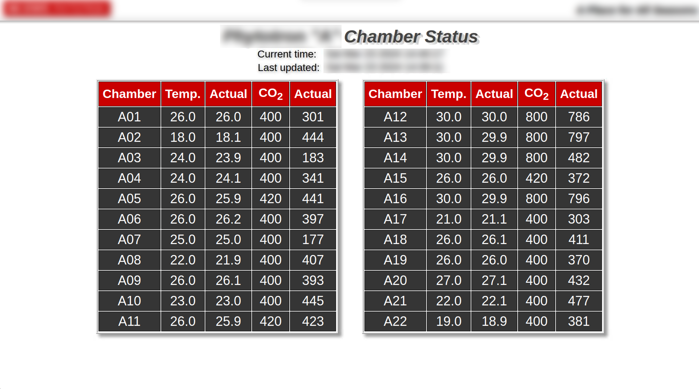
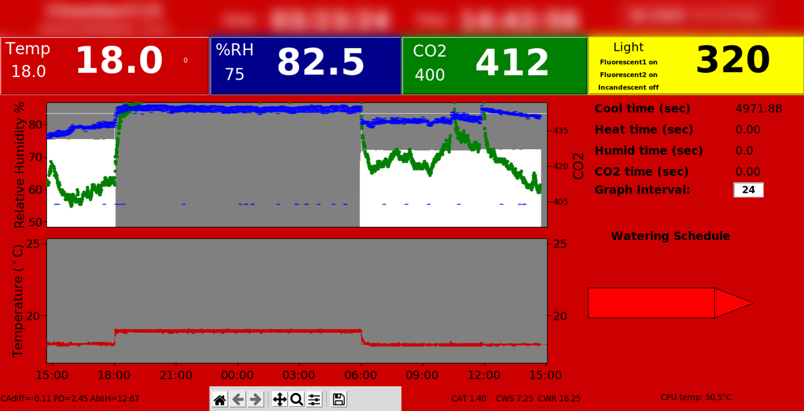
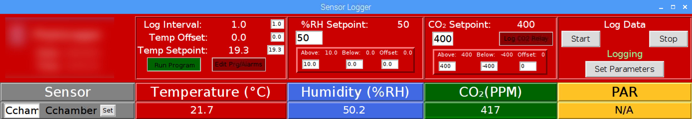
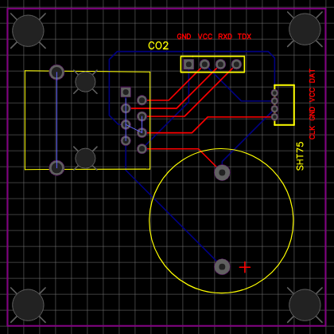

## Columbia University Information Technology
**Contributions**
- System Administration
- Technical Support
  - Hardware & Software updates
  - Firmware updates
  - Asset management
- Cloud Security Screening
- Data Security
- Research Software Consultant
- Collaborate with HPC Team

**Development**
* Documentation & Trainings

## Upward Farms
**Contributions**
- System Administration
- Sensor Systems
- Technical Support
  - AWS Workspaces
  - Data Reporting
  - InfluxDB Management
  - Account Management
  - Company Tech Stack
  - Visitor Management System
- Project Management

**Development**
- Supplemental Monitoring
  - Air: Temperaturem, CO2, & Humidity
  - Water: Dissolved Oxygen (DO), Conductivity (EC), pH levels, & Level
  - Power: Current (A)
- Improved RFID-based Inventory Tracking System

## NCSU Phytotron
**Contributions**
- System Administration
  - Redhat Linux
  - Debian
  - mySQL
- Technical Support
  - Data Management - Data transfer & visualization
- Developing Custom Controller
- Networking
- Sensor Systems
  - Research, develop, & deploy air quality sensor systems

**Development**
- Google App script-based request
  - Automated Google form onSubmit to email equipment project requests
- Python-based RaspberryPi Microcontroller
  - Microcontroller that controls temperature, CO2, humidity, & light
- Python-base air quality data logger
- Various PHP-based dashboards
  - Real-time air quality monitoring
- Cron jobs for data transfer
- PCB Boards
  - Developed air qualtiy sensor loggers
  - Developed custom PWM boards

## Work Gallery

[back](./)
