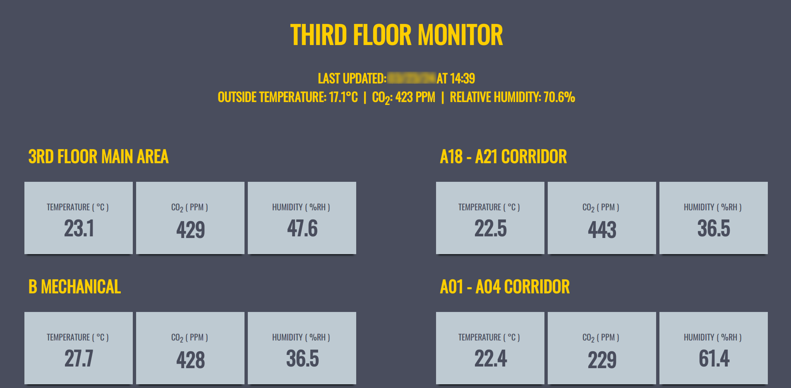
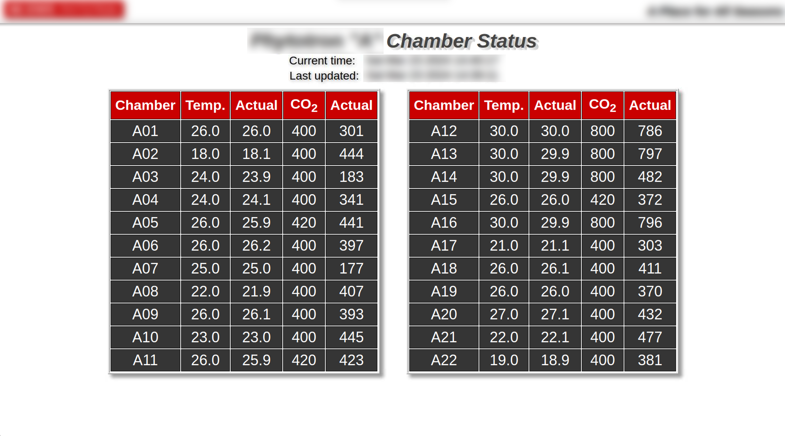

## Columbia University Information System
Contributions
* System Administration
* Technical Support
* Data Security
* Research Software Consultant
* Collaborate with HPC Team

Development
* Documentation & Trainings

## Upward Farms
Contributions
* System Administration
* Data Reporting Support
* Sensor Systems
* Technical Support
* Project Management

Development
- Supplemental Monitoring
  - Air: Temperaturem, CO2, & Humidity
  - Water: Dissolved Oxygen (DO), Conductivity (EC), pH levels, & Level
  - Power: Current (A)
- Improved RFID-based Inventory Tracking System

## NCSU Phytotron
Contributions
* System Administration
* Developing Custom Controller
* Data Management
* Sensor Systems

Development
- Google App script-based request
  -Automated Google form onSubmit to email equipment project requests
- Python-based microcontroller
- Various PHP-based dashboards
  - Real-time air quality monitoring
- PCB Boards
  - Developed air qualtiy sensor loggers
  - Developed custom PWM boards

## Images

[back](./)
